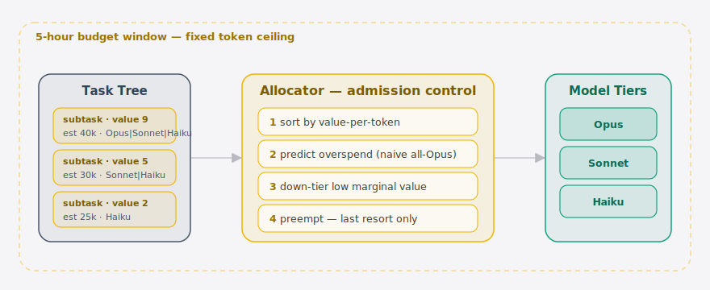
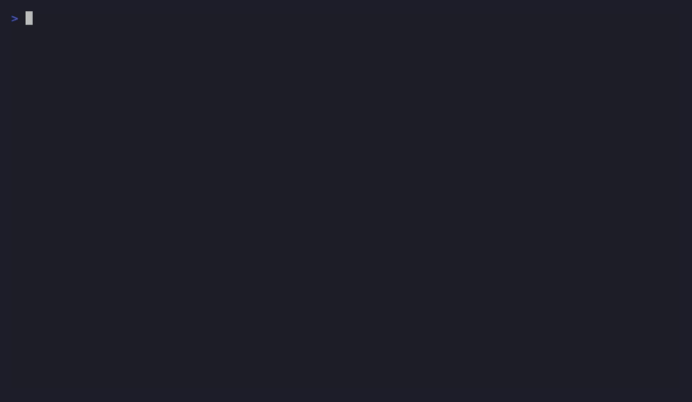
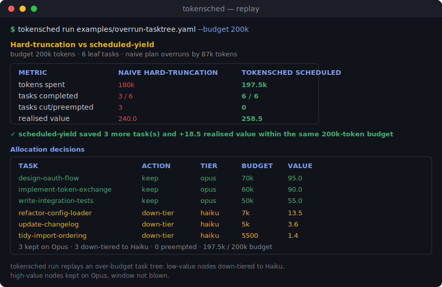

<div align="center">

[English](./README.en.md) | 简体中文


<p>
  <strong>给 Claude Code 的 token 预算装上一个 CPU 调度器</strong><br/>
  按子任务期望值预分配预算 · 预测超支 · 在窗口耗尽前自动降级或抢占
</p>

<p>
  <a href="https://golang.org"></a>
  <a href="./LICENSE"></a>
  <a href="https://github.com/SuperMarioYL/tokensched/actions/workflows/ci.yml"></a>
  <a href="https://github.com/SuperMarioYL/tokensched/stargazers"></a>
</p>

</div>

---

##  这是什么

**TokenSched** 是给 [Claude Code](https://docs.anthropic.com/en/docs/claude-code) 重度用户的 **token 预算调度器**。

把一棵会撞墙的任务树（一个 Agent 计划要跑的若干子任务，各自带「价值」「预估 token」「可用模型档位」）交给它，它会像操作系统调度 CPU 时间片一样调度 token 预算：

- **按 value-per-token 预分配** —— 高价值子任务优先拿到预算，永远不是第一个被砍的；
- **预测超支** —— 在动手前就算出朴素的「全 Opus」方案会超出窗口多少 token；
- **自动降级与抢占** —— 超支时，把边际价值最低的子任务从 Opus 降到 Sonnet 再降到 Haiku（down-tier），只有当它已在最便宜的档位仍放不下时才抢占（preempt）。

一句话：**把硬截断（hard truncation）变成可调度的软退让（scheduled yield）。** 当你今天的 Agent 撞上 Claude Code 的 5 小时窗口时，最重要的那个子任务往往恰好被硬截断掉；TokenSched 让低价值工作先让路，把高价值工作留在 Opus 上、整棵树跑在预算内。

> TokenSched 是**分配器（allocator）**，不是压缩器（compressor）。它不改你的 payload，而是在任务树层做准入控制（admission control）：决定*哪个子任务*值得花 token，以及该花在*哪个档位*。

##  架构

<p align="center">
  <picture>
    <source media="(prefers-color-scheme: dark)" srcset="./assets/atlas-dark.svg">
    <source media="(prefers-color-scheme: light)" srcset="./assets/atlas-light.svg">
    
  </picture>
</p>

一棵任务树（每个子任务带价值、预估 token、可用档位）进入**分配器**。分配器像 OS 调度 CPU 一样做准入控制：① 按 value-per-token 排序 → ② 预测「全 Opus」会超支多少 → ③ 把边际价值最低的子任务降档（Opus→Sonnet→Haiku）→ ④ 仅当已在最便宜档位仍放不下时才抢占。最终每个子任务落到某个**模型档位**，整棵树跑在 5 小时**预算窗口**内。

##  快速开始

安装（单二进制，零网络、零守护进程）：

```bash
go install github.com/SuperMarioYL/tokensched/cmd/tokensched@latest
```

**1. 查看任务树与每节点初始预算（`plan`）：**

```bash
tokensched plan examples/overrun-tasktree.yaml --budget 200k
```

```text
Task tree — ship-auth-feature
budget: 200k tokens

ship-auth-feature
├─ design-oauth-flow  value=95  tiers=[opus,sonnet,haiku]  init=opus@70k tok
├─ implement-token-exchange  value=90  tiers=[opus,sonnet,haiku]  init=opus@60k tok
├─ write-integration-tests  value=55  tiers=[opus,sonnet,haiku]  init=opus@50k tok
├─ refactor-config-loader  value=30  tiers=[sonnet,haiku]  init=sonnet@22k tok
├─ update-changelog  value=8  tiers=[opus,sonnet,haiku]  init=opus@40k tok
└─ tidy-import-ordering  value=3  tiers=[opus,sonnet,haiku]  init=opus@45k tok

6 leaf tasks · naive all-top-tier demand = 287k tokens  (overruns budget by 87k)
```

**2. 回放「朴素硬截断 vs 调度退让」对比（`run`）：**

```bash
tokensched run examples/overrun-tasktree.yaml --budget 200k
```

`--budget` 接受纯整数或 `k`/`m` 后缀（如 `200k`、`1.5m`、`200000`）。把 `examples/overrun-tasktree.yaml` 复制一份，按注释填上你自己子任务的 `value` / `est_tokens` / `tiers` 即可。

##  Demo

同一棵 200k 预算下注定超支的任务树，两种执行方式的对比：朴素执行在窗口耗尽时硬截断掉 3 个子任务（含最重要的一个）；TokenSched 把低价值节点降级到 Haiku、保住全部高价值节点在 Opus 上，6 个子任务全部跑完且未超预算。

<p align="center">
  
</p>

<sub>↑ 终端实录（由 CI 用 <a href="https://github.com/charmbracelet/vhs">vhs</a> 渲染 <a href="./docs/demo.tape">docs/demo.tape</a>，打 tag 时自动生成）。下方为前后对比静图：</sub>

<div align="center">
  
</div>

| 指标 | 朴素硬截断 | TokenSched 调度 |
| --- | --- | --- |
| tokens 花费 | 180k | 197.5k |
| 完成子任务 | **3 / 6** | **6 / 6** |
| 被砍 / 抢占 | 3 | 0 |
| 实现价值 | 240.0 | **258.5** |

`design-oauth-flow`、`implement-token-exchange`、`write-integration-tests` 三个高价值节点保留在 Opus；`refactor-config-loader`、`update-changelog`、`tidy-import-ordering` 三个低价值节点降级到 Haiku，整棵树落在 197.5k / 200k 预算内。

##  为什么需要它

**痛点**：[Claude Code](https://docs.anthropic.com/en/docs/claude-code) 重度用户经常在 5 小时用量窗口里跑一长串子任务，撞墙时被硬截断 —— 而被截断的常常恰好是排在后面、却最重要的工作。今天大家的应对方式是手动把某些步骤切到 Haiku「省着烧表」，靠临场判断、无法在任务进行中动态抢占。

**TokenSched 把这个动作系统化为一个原语**：「**按子任务期望值的 token 准入控制器**」（per-subtask token admission-controller）。它有清晰、可复用的接口（任务树价值估计 + 抢占钩子），是一个独立的调度原语，而不是埋在某个 harness 里的一个开关。

它面向 **Agent 基础设施**：调度器在一个 Agent 的子任务树上分配 token 预算 —— 这正是 agent infra 层缺失的一环。你可以把核心分配器当作一个 Go package `import` 进自己的 Agent 编排框架，给任意 Agent 套上可解释的预算上限：

```go
import (
    "github.com/SuperMarioYL/tokensched/internal/budget"
    "github.com/SuperMarioYL/tokensched/internal/schedule"
    "github.com/SuperMarioYL/tokensched/internal/tasktree"
)

// 1. 构建（或从 YAML 解析）一棵任务树
root, _ := tasktree.LoadFile("tree.yaml")

// 2. 直接用贪心分配器拿决策（Keep / DownTier / Preempt）
alloc := budget.NewGreedyAllocator(nil)
decisions := alloc.Allocate(root, 200_000)

// 3. 或用调度器，并挂一个自定义抢占钩子
sched := schedule.New(&schedule.Options{
    Hook: schedule.PreemptBelow(10), // 价值 < 10 的子任务直接抢占
})
plan := sched.Schedule(root, 200_000)
_ = decisions
_ = plan
```

`budget.Allocator` 接口、`budget.PreemptionHook` 钩子、以及 `tier` 的成本/能力系数都是稳定可复用的 API（见 `policy.example.yaml` 了解可调策略）。

> v0.1 不打真实 API：分配与对比都基于声明的预估值进行确定性 replay/模拟。线上拦截真实流量是后续版本的事（见路线图）。

##  路线图

| 版本 | 状态 | 内容 |
| --- | --- | --- |
| **v0.1.0** | ✅ 已发布 | `plan` 解析任务树并分配初始预算；`run` 回放朴素硬截断 vs 调度退让；按 value-per-token 贪心分配 + 降级/抢占；可 `import` 的分配器 / 抢占钩子 API；lipgloss 终端报告。 |
| v0.2 | 计划中 | 接入真实 token schema 与活计量；常驻 daemon 观察真实 5 小时窗口。 |
| v0.3 | 探索中 | 用学习模型自动估计子任务价值；多 agent 共享预算池。 |

**v0.1 明确不做**：拦截真实 Claude Code / Anthropic API 流量的 inline 网关 · 学习模型自动估值 · Web UI / dashboard · 多用户共享预算池 · 账号 / 云托管 / 收费档位 · token 压缩 / payload 减量（那是压缩器的活，TokenSched 是分配器）。

##  许可

本项目采用 **MIT** 许可，纯开源、无收费功能。详见 [LICENSE](./LICENSE)。

---

<div align="center">
  <a href="./LICENSE">MIT</a> © 2026 SuperMarioYL
</div>
