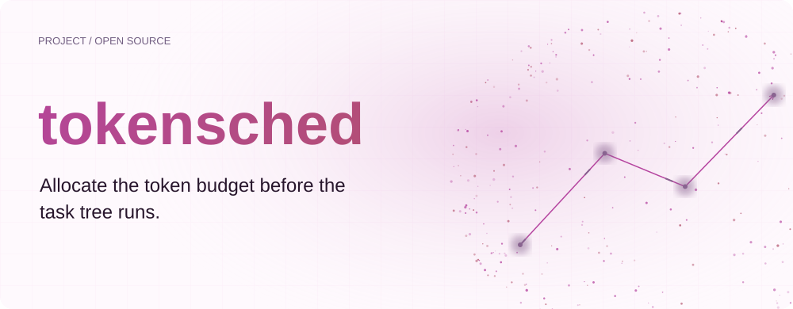
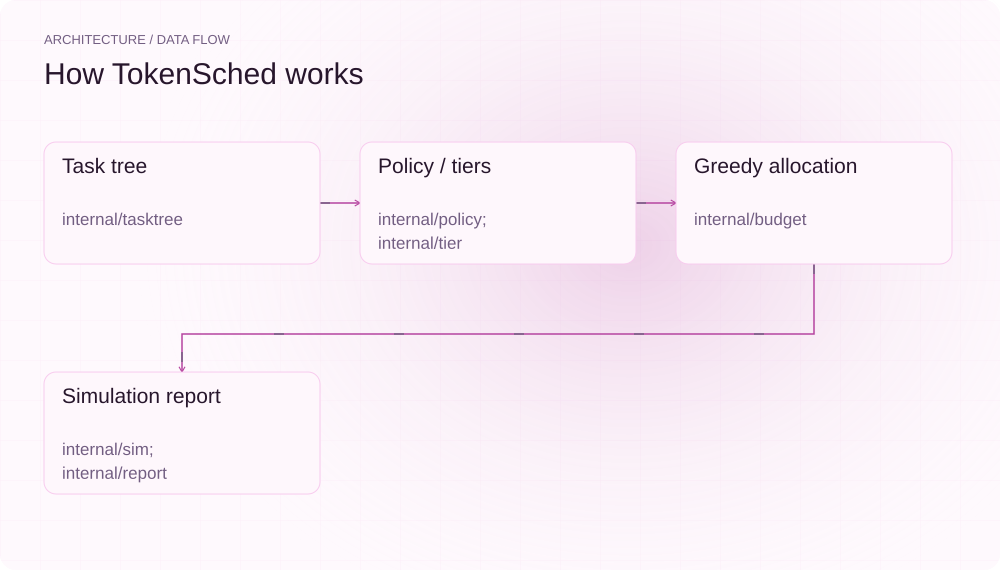
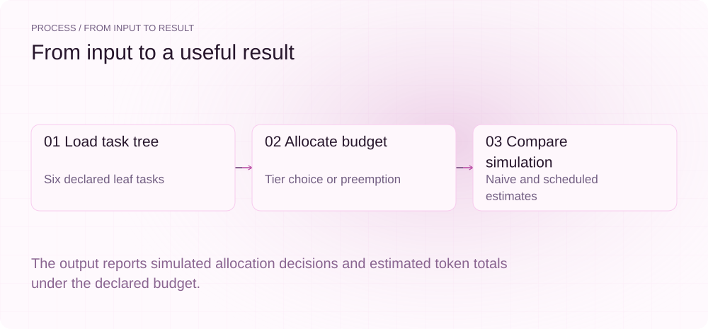
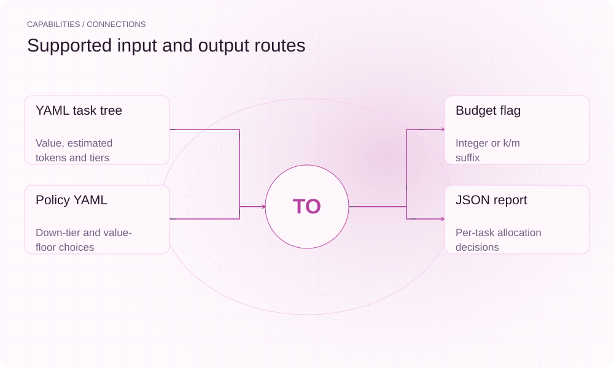

[English](./README.en.md) · [Website](https://tokensched.lei6393.com) · [GitHub](https://github.com/SuperMarioYL/tokensched)

<picture>
  <source media="(max-width: 600px) and (prefers-color-scheme: dark)" srcset="./assets/presentation/hero-mobile-dark.svg">
  <source media="(max-width: 600px)" srcset="./assets/presentation/hero-mobile-light.svg">
  <source media="(prefers-color-scheme: dark)" srcset="./assets/presentation/hero-dark.svg">
  
</picture>

# tokensched

**在任务树运行前分配 token 预算。**

TokenSched 将声明的任务树转换为预算分配，并与朴素最高档位模拟进行比较。

## 为什么需要它

预估任务需求超过固定预算时，一些工作需要降档或等待。显式分配可以在调用框架消费 token 前展示这些选择。

- **执行前预算** — 模型调用前即可检查预期需求。
- **解释档位选择** — 每个任务获得明确分配动作。
- **导出决策** — JSON 可供外部编排器使用。

## 架构

<picture>
  <source media="(max-width: 600px) and (prefers-color-scheme: dark)" srcset="./assets/presentation/architecture-mobile-dark.svg">
  <source media="(max-width: 600px)" srcset="./assets/presentation/architecture-mobile-light.svg">
  <source media="(prefers-color-scheme: dark)" srcset="./assets/presentation/architecture-dark.svg">
  
</picture>

YAML 加载器生成包含价值、预估 token 和可用档位的任务叶子。贪心分配器按单位 token 价值排序，在剩余预算内安排任务，根据策略降档或抢占。模拟器再与按声明顺序运行的朴素策略比较。

| 组件 | 职责 |
| --- | --- |
| `Task tree` | internal/tasktree |
| `Policy / tiers` | internal/policy; internal/tier |
| `Greedy allocation` | internal/budget |
| `Simulation report` | internal/sim; internal/report |

## 安装与快速上手

使用仓库清单指定的运行时版本构建，并在仓库根目录运行示例。

```bash
git clone https://github.com/SuperMarioYL/tokensched.git
cd tokensched
go build ./cmd/tokensched
```

以 200000-token 预算模拟随仓六任务树，并打印实际分配报告。

```bash
python3 examples/presentation-demo.py
```

## 实际运行示例

<picture>
  <source media="(max-width: 600px) and (prefers-color-scheme: dark)" srcset="./assets/presentation/process-mobile-dark.svg">
  <source media="(max-width: 600px)" srcset="./assets/presentation/process-mobile-light.svg">
  <source media="(prefers-color-scheme: dark)" srcset="./assets/presentation/process-dark.svg">
  
</picture>

The output reports simulated allocation decisions and estimated token totals under the declared budget.

```text
{
  "budget": 200000,
  "overrun_tokens": 87000,
  "naive": {
    "strategy": "hard-truncation",
    "spent_tokens": 180000,
    "value": 240,
    "completed": 3,
    "truncated": 3,
    "decisions": [
      {
        "task_id": "design-oauth-flow",
        "action": "keep",
        "tier": "opus",
        "budget_tokens": 70000,
        "value": 95,
        "reason": "ran on opus in declared order (no scheduling)"
      },
      {
        "task_id": "implement-token-exchange",
        "action": "keep",
        "tier": "opus",
        "budget_tokens": 60000,
        "value": 90,
        "reason": "ran on opus in declared order (no scheduling)"
      },
      {
        "task_id": "write-integration-tests",
        "action": "keep",
        "tier": "opus",
        "budget_tokens": 50000,
        "value": 55,
        "reason": "ran on opus in declared order (no scheduling)"
      },
      {
        "task_id": "refactor-config-loader",
        "action": "preempt",
        "tier": "",
        "budget_tokens": 0,
        "value": 0,
        "reason": "hard-truncated: budget exhausted before this task"
      },
      {
        "task_id": "update-changelog",
        "action": "preempt",
        "tier": "",
        "budget_tokens": 0,
        "value": 0,
        "reason": "hard-truncated: budget exhausted before this task"
      },
      {
        "task_id": "tidy-import-ordering",
        "action": "preempt",
        "tier": "",
        "budget_tokens": 0,
        "value": 0,
        "reason": "hard-truncated: budget exhausted before this task"
      }
    ]
  },
  "scheduled": {
    "strategy": "scheduled",
    "spent_tokens": 197500,
    "value": 258.45000000000005,
    "completed": 6,
    "truncated": 0,
    "decisions": [
      {
        "task_id": "design-oauth-flow",
        "action": "keep",
        "tier": "opus",
        "budget_tokens": 70000,
        "value": 95,
        "reason": "fits on opus at 70000 tok (v/tok=0.00136); kept"
      },
      {
        "task_id": "implement-token-exchange",
        "action": "keep",
        "tier": "opus",
        "budget_tokens": 60000,
        "value": 90,
        "reason": "fits on opus at 60000 tok (v/tok=0.00150); kept"
      },
      {
        "task_id": "write-integration-tests",
        "action": "keep",
        "tier": "opus",
        "budget_tokens": 50000,
        "value": 55,
        "reason": "fits on opus at 50000 tok (v/tok=0.00110); kept"
      },
      {
        "task_id": "refactor-config-loader",
        "action": "down-tier",
        "tier": "haiku",
        "budget_tokens": 7000,
        "value": 13.5,
        "reason": "won't fit on sonnet (22000>20000 rem); down-tiered to haiku at 7000 tok"
      },
      {
        "task_id": "update-changelog",
        "action": "down-tier",
        "tier": "haiku",
        "budget_tokens": 5000,
        "value": 3.6,
        "reason": "won't fit on opus (40000>13000 rem); down-tiered to haiku at 5000 tok"
      },
      {
        "task_id": "tidy-import-ordering",
        "action": "down-tier",
        "tier": "haiku",
        "budget_tokens": 5500,
        "value": 1.35,
        "reason": "won't fit on opus (45000>8000 rem); down-tiered to haiku at 5500 tok"
      }
    ]
  },
  "tasks_saved": 3
}
```

完整命令与输出保存在 [docs/demo-results.json](./docs/demo-results.json). 输入和复现代码均随仓提供。


保留已有录制供参考；上方文字示例给出当前可复现的操作。

## 用法

CLI 提供以下操作。示例之外的命令需要替换成你的文件路径或标识。

```bash
go run ./cmd/tokensched plan examples/overrun-tasktree.yaml --budget 200k
go run ./cmd/tokensched run examples/overrun-tasktree.yaml --budget 200k --json
go run ./cmd/tokensched run examples/overrun-tasktree.yaml --budget 200k --policy policy.example.yaml
```

## 配置

run 要求正值 --budget。--policy 读取 preemption.prefer_downtier 与 preemption.preempt_below_value。实现中的档位成本与能力系数缩放估计值；采用计划前应针对自己的负载验证假设。

## 集成与职责分工

<picture>
  <source media="(max-width: 600px) and (prefers-color-scheme: dark)" srcset="./assets/presentation/integrations-mobile-dark.svg">
  <source media="(max-width: 600px)" srcset="./assets/presentation/integrations-mobile-light.svg">
  <source media="(prefers-color-scheme: dark)" srcset="./assets/presentation/integrations-dark.svg">
  
</picture>

以下路径已有源码实现。按任务选择输入，并把生成的结果与项目一起保存。

| 路径 | 已实现职责 |
| --- | --- |
| YAML task tree | Value, estimated tokens and tiers |
| Budget flag | Integer or k/m suffix |
| Policy YAML | Down-tier and value-floor choices |
| JSON report | Per-task allocation decisions |

## 限制与后续方向

- run 是确定性模拟，不是模型执行循环。数量与价值分数来自声明估计和系数。
- CLI 不控制账号用量窗口，也不能阻止外部框架消费超出计划。
- 档位价值系数是假设，不是实测模型质量。

在线调用框架执行与估计校准属于当前模拟 CLI 之外的集成工作。

## 许可与贡献

许可见 [LICENSE](./LICENSE). 反馈问题时请提供最小输入、执行命令和实际输出。
